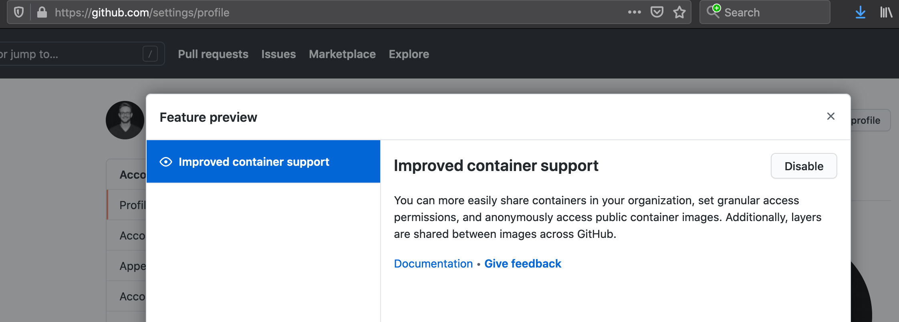
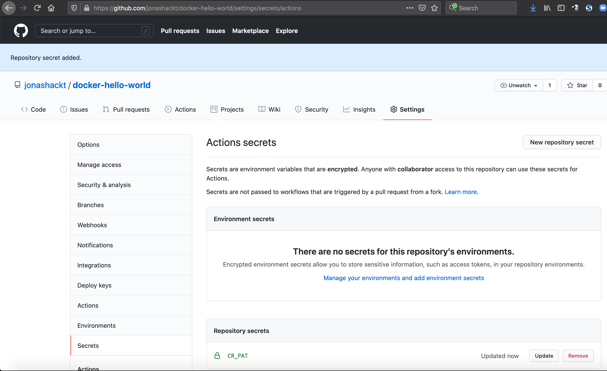

# docker-hello-world
[](https://github.com/jonashackt/docker-hello-world/actions)

Example hello world container showing how to use GitHub Container Registry


As Docker Inc introduced a rate-limiting https://www.docker.com/increase-rate-limits I began to bump [into problems like this](https://github.com/jonashackt/molecule-ansible-docker-aws/runs/1968417806?check_suite_focus=true) while running a simple `docker run hello-world` on GitHub Actions:

```
Unable to find image 'hello...se the limit by authenticating and upgrading: https://www.docker.com/increase-rate-limit.\nSee 'docker run --help'.\n"
```

Many [people started to migrate their Docker images](https://medium.com/faun/migrating-my-docker-images-to-the-github-container-registry-9f304ccf0aaa) to the new GitHub Container Registry, which is currently in public beta: https://docs.github.com/en/packages/guides/pushing-and-pulling-docker-images

And there are already many projects that are simply not available anymore on DockerHub - but on GitHub Container Registry (like https://hub.docker.com/r/oracle/graalvm-ce to https://github.com/orgs/graalvm/packages/container/package/graalvm-ce)

Well I thought why not crafting a simple and small `hello-world` image and publish it to GitHub Container Registry?!


### A simple Go executable

The [original hello-world image from Docker](https://github.com/docker-library/hello-world) also uses a small executable to print a text. I decided to go with golang to create a ultra-small executable myself. 

So there's [hello-world.go](hello-world.go):

```go
package main

import "fmt"

func main() {
	fmt.Println("Hello from Docker on GitHub Container Registry!\nThis message shows that your installation appears to be working correctly.\n\nAs Docker Inc introduced rate-limiting in https://www.docker.com/increase-rate-limits\nwe simply need our own hello-world image on GitHub Container Registry.\n\nTo generate this message, Docker took the following steps:\n 1. The Docker client contacted the Docker daemon.\n 2. The Docker daemon pulled this \"hello-world\" image from the GitHub Container Registry.\n    (amd64)\n 3. The Docker daemon created a new container from that image which runs the\n    executable that produces the output you are currently reading.\n 4. The Docker daemon streamed that output to the Docker client, which sent it\n    to your terminal.\n\n")
}
```

Build it (you need to have go installed with like `brew install go`) with:

```shell
go build hello-world.go
```

This produces a `hello-world` executable you can simply run with `./hello world`.


### A Docker multistage Build for GO

As we only need to have Go runtime stuff present to build the binary, we should implement a Docker multi-stage build. Since the GO Docker image https://hub.docker.com/_/golang is quite huge:
```shell
$ docker images
golang                             latest                861b1afd1d13   7 days ago       862MB
```

Therefore let's split our [Dockerfile](Dockerfile) a bit:

```dockerfile
# We need a golang build environment first
FROM golang:1.16.0-alpine3.13

WORKDIR /go/src/app
ADD hello-world.go /go/src/app

RUN go build hello-world.go

# We use a Docker multi-stage build here in order that we only take the compiled go executable
FROM alpine:3.13

COPY --from=0 "/go/src/app/hello-world" hello-world

ENTRYPOINT ./hello-world
```

The second "run" image is based on the same https://hub.docker.com/_/alpine image as the builder image containing the GO runtimes.

Now let's build and run our image:

```shell
$ docker build . --tag hello-world
$ docker run hello-world
Hello from Docker on GitHub Container Registry!
This message shows that your installation appears to be working correctly.

As Docker Inc introduced rate-limiting in https://www.docker.com/increase-rate-limits
we simply need our own hello-world image on GitHub Container Registry.

To generate this message, Docker took the following steps:
 1. The Docker client contacted the Docker daemon.
 2. The Docker daemon pulled this "hello-world" image from the GitHub Container Registry.
    (amd64)
 3. The Docker daemon created a new container from that image which runs the
    executable that produces the output you are currently reading.
 4. The Docker daemon streamed that output to the Docker client, which sent it
    to your terminal.
```

The resulting image is around `7.55MB` which should be small enough for our use cases.


### Publish the Docker image to GitHub Container Registry

We follow the full guide here: https://docs.github.com/en/packages/guides/pushing-and-pulling-docker-images

#### Activate improved container support

First we need to activate the Container Registry beta feature in our account: https://docs.github.com/en/packages/guides/enabling-improved-container-support




#### Authenticate and login to GitHub Container Registry using a PAT

Right now (in beta) [using the `GITHUB_TOKEN` to authenticate to the GHCR isn't possible](https://docs.github.com/en/packages/guides/pushing-and-pulling-docker-images#authenticating-to-github-container-registry). So we need to create a personal access token (PAT). But mind what the docs say:

> PATs can grant broad access to your account. We recommend selecting only the necessary read, write, or delete package scope when creating a PAT to authenticate to the container registry. Avoid including the repo scope in a PAT used by a GitHub Actions workflow because it gives unnecessary additional access.

Here's the guide on how to create a PAT in Settings/Developer settings/Personal access tokens: https://docs.github.com/en/github/authenticating-to-github/creating-a-personal-access-token You need to select `read:packages`, `write:packages` and `delete:packages` scopes like this:


Using the token we should now create a new repository secret inside our repo settings:



With all that set up we can now use the secret inside our GHA workflow file [publish.yml](.github/workflows/publish.yml):

```yaml
name: publish

on: [push]

jobs:
  publish-hello-world-image:
    runs-on: ubuntu-latest

    steps:
    - uses: actions/checkout@v2

    - name: Build the hello-world Docker image
      run: |
        echo $CR_PAT | docker login ghcr.io -u jonashackt --password-stdin
      env:
        CR_PAT: ${{ secrets.CR_PAT }}
```

#### Publish (Push) Container image to GHCR

The final step now is to push our container image to the GitHub Container Registry. Therefore we need to tag our image correctly while building it using `ghcr.io/OWNER/IMAGE_NAME:latest`. After that we can push it:

```yaml
        docker build . --tag ghcr.io/jonashackt/hello-world:latest
        docker run ghcr.io/jonashackt/hello-world:latest
        docker push ghcr.io/jonashackt/hello-world:latest
```

